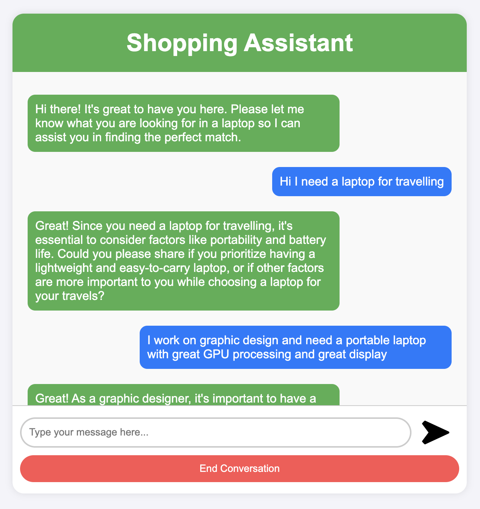
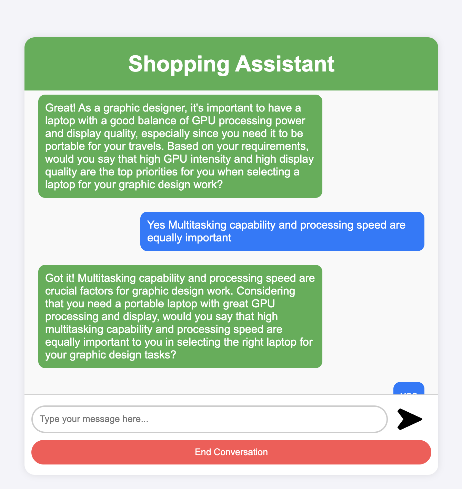
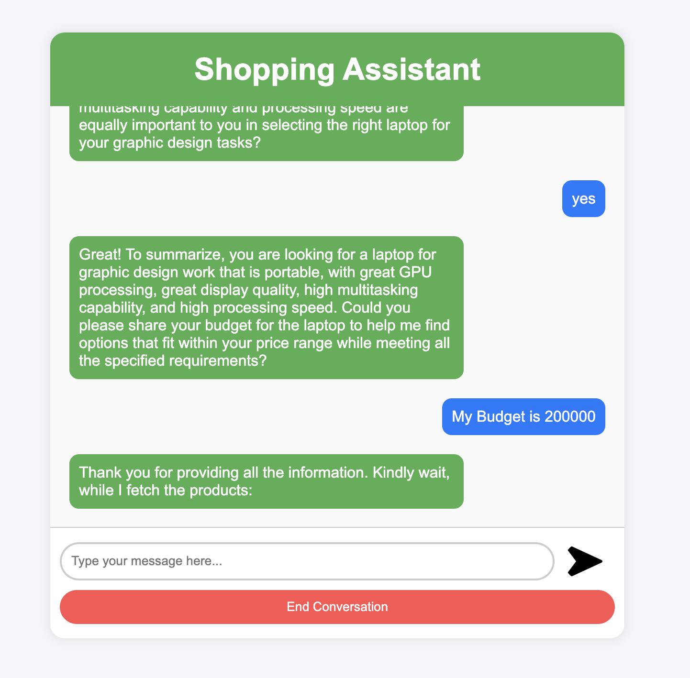
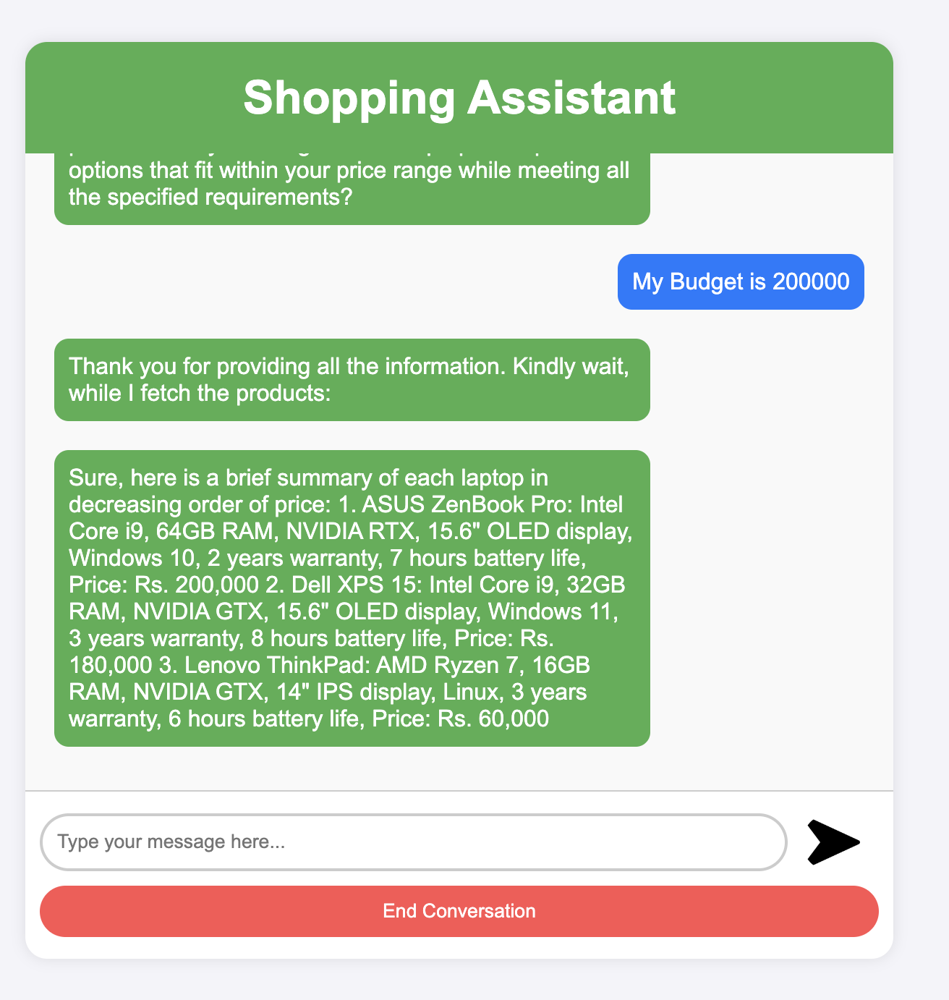

#IMPORTANT

Since the OpenAPI key is a secret **it has not been checked in**. Before running the project remember to create an **api_key.txt** file and add the openAPI key into that file 

# ShopAssistAI
Conversational Laptop Recommendation System using Open AI function calling

## 1. Introduction

ShopAssistAI is a web-based conversational application designed to help users find the perfect laptop based on their needs. It leverages the power of Generative Artificial Intelligence (AI) to guide users through a conversation, gather their preferences, and recommend suitable laptops from a database.

## 2. System Requirements

- **Front-End:** HTML, CSS, JavaScript
- **Back-End:** Python, Flask web framework
- **AI Engine:** OpenAI's API for conversation generation and moderation
- **Database:** External database to store laptop data (specifications, models, etc.)

## 3. System Functionalities

- **User Interface:** ShopAssistAI provides a user-friendly web interface where users can interact with the conversational AI assistant.
- **Conversational AI:** The core of ShopAssistAI is the conversational AI powered by OpenAI's chat model. It guides the user through the process by asking relevant questions and understanding their needs.
- **User Input Moderation:** User input is moderated using OpenAI's moderation API to ensure a safe and secure conversation.
- **User Profile Extraction:** The AI assistant extracts key information from the conversation to build a user profile that reflects their laptop preferences (budget, screen size, processing power, etc.) using OpenAI's function calling mechanism to convert a user requirement string into a JSON object.

### 3.1 Extracting User Requirements

ShopAssistAI utilizes OpenAI's chat-completion endpoint to generate responses and potentially extract user requirements within the conversation flow. This is achieved by sending prompts and conversation history to the API, and the response might contain user-expressed preferences. While OpenAI's API doesn't natively convert text to JSON, OpenAI’s function calling mechanism is used to convert user string extracts to relevant user requirements as key-value pairs.

### 3.2 Building the User Profile

The extracted key-value pairs are used to construct a user profile dictionary in JSON format, representing the user's preferences for various laptop attributes.

## 4. System Architecture

ShopAssistAI follows a client-server architecture. Users interact with the web interface hosted on a server running the Flask application. The application interacts with OpenAI's API for conversation generation and moderation and retrieves and compares laptop data from an external database.

## 5. Implementation Details

The Flask application utilizes various functionalities:

- **Routing:** Maps user requests to appropriate functions based on URLs.
- **Conversation Management:** Handles conversation initiation, response generation through OpenAI's chat model, and conversation history maintenance.
- **User Input Processing:** Captures user input, performs moderation checks, and extracts user profiles from conversation history (converting user input string to JSON using OpenAI Function calling).
- **Recommendation Logic:** Compares user profiles with laptop data, validates recommendations, and generates recommendation text.

## 6. Conclusion

ShopAssistAI provides an interactive and user-friendly way for users to find the perfect laptop. By leveraging AI-powered conversation and personalized recommendations, ShopAssistAI simplifies the laptop selection process. 

## 7. Appendix - I

### Key Points:

- User interacts through a web browser.
- Flask web app receives the request and routes it to the appropriate function based on the URL.
- Two main functionalities: Invite flow (initial conversation) and Recommendation flow.
- Both functionalities involve:
  - Moderating user input.
  - Using OpenAI's chat model to generate responses.
  - Extracting user profile or validating recommendations.
- The application communicates with an external source (likely a database) to compare user profiles with laptop data.
- Recommendations are validated before presenting them to the user.
- The conversation history is updated after each interaction.

## 8. Appendix - II

User output example screenshot:

1. Screenshot 1:

2. Screenshot 2:

3. Screenshot 3:

4. Screenshot 4:

