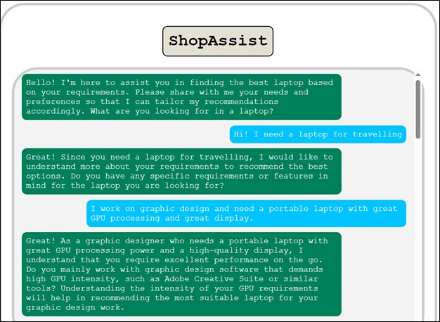
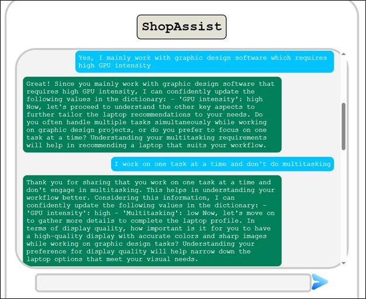
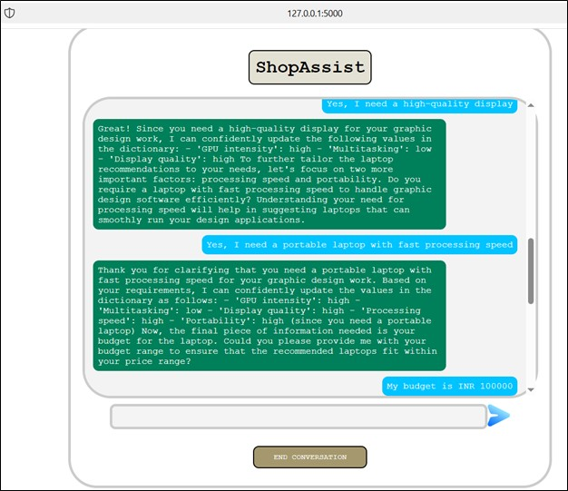
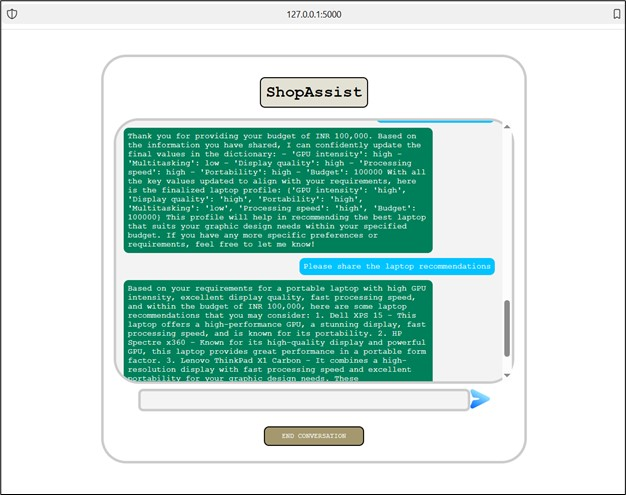
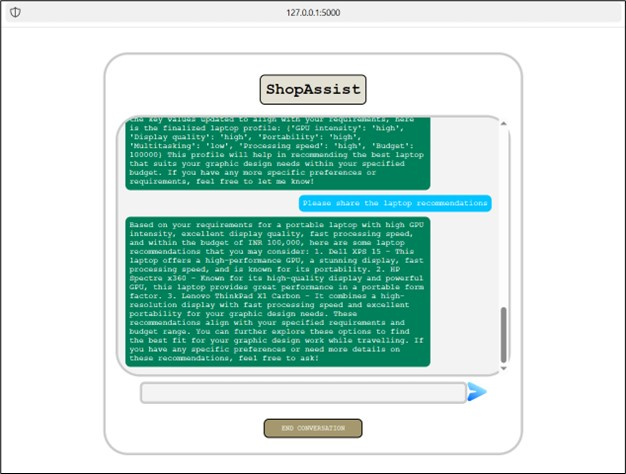

# ShopAssistAI
Conversational Laptop Recommendation System using Open AI function calling
<table><tbody><tr><th>
Project Report
<h3>ShopAssistAI: Conversational Laptop Recommendation System using Open AI function calling.</h3><h3>Date: 03/15/2024</h3>
Name: Anand Vardhan Sharan
</th></tr></tbody></table>

**1\. Introduction**

ShopAssistAI is a web-based conversational application designed to assist users in finding the perfect laptop based on their needs. It leverages the power of Generative Artificial Intelligence (AI) to guide users through a conversation, gather their preferences, and recommend suitable laptops from a database.

**2\. System Requirements**

- **Front-End:** HTML, CSS, Javascript
- **Back-End:** Python, Flask web framework
- **AI Engine:** OpenAI's API for conversation generation and moderation
- **Database:** External database to store laptop data (specifications, models, etc.)

**3\. System functionalities**

- **User Interface:** ShopAssistAI provides a user-friendly web interface where users can interact with the conversational AI assistant.
- **Conversational AI:** The core of ShopAssistAI is the conversational AI powered by OpenAI's chat model. It guides the user through the process by asking relevant questions and understanding their needs.
- **User Input Moderation:** User input is moderated using OpenAI's moderation API to ensure a safe and secure conversation.
- **User Profile Extraction:** The AI assistant extracts key information from the conversation to build a user profile that reflects their laptop preferences (budget, screen size, processing power, etc.). OpenAI's function calling mechanism is designed to convert a user_requirement string object into a JSON object.

**3.1. Extracting User Requirements**

- ShopAssistAI utilizes OpenAI's chat-completion endpoint to generate responses and potentially extract user requirements within the conversation flow. This is achieved by sending prompts and conversation history to the API, and the response might contain user-expressed preferences.
- While OpenAI's API doesn't natively convert text to JSON, the OpenAI’s function calling mechanism and technique is used to convert the user string extract to relevant user requirements as key-value pairs.

**3.2. Building the User Profile**

- The extracted key-value pairs can then be used to construct a user profile dictionary in JSON format. This dictionary would represent the user's preferences for various laptop attributes.

**4\. System Architecture**

ShopAssistAI follows a client-server architecture. The user interacts with the web interface hosted on a server running the Flask application. The application interacts with OpenAI's API for conversation generation and moderation. Additionally, it retrieves and compares laptop data from an external database.

**5\. Implementation Details**

The Flask application utilizes various functionalities:

- **Routing:** Maps user requests to appropriate functions based on URLs.
- **Conversation Management:** Handles conversation initiation, response generation through OpenAI's chat model, and conversation history maintenance.
- **User Input Processing:** Captures user input, performs moderation checks, and extracts user profiles from conversation history (using Open AI Function calling it converts the user input string to JSON object).
- **Recommendation Logic:** Compares user profiles with laptop data, validates recommendations, and generates recommendation text.

**6\. Evaluation and Testing**

- **Unit Testing:** Individual functionalities within the Flask application can be unit-tested to ensure proper behavior.
- **User Acceptance Testing (UAT):** User testing with a representative group can assess the application's usability, effectiveness, and overall user experience.
- **A/B Testing:** Different conversation flows or recommendation algorithms can be A/B tested to determine the most user-friendly and effective approach.

**7\. Conclusion**

ShopAssistAI provides a user-friendly and interactive way for users to find the perfect laptop. By leveraging AI-powered conversation and personalized recommendations, ShopAssistAI simplifies the laptop selection process. Future development could involve:

- Integrating a wider variety of AI models for more sophisticated conversation capabilities and potentially leveraging OpenAI's fine-tuning abilities to tailor the model to the laptop recommendation domain.
- Expanding the recommendation engine to include other electronic products.
- Implementing a user feedback mechanism to continuously improve the recommendation accuracy and potentially using reinforcement learning techniques for this purpose.

**8\. Appendix - I**

High level flow chart

Invite Flow

Intent Confirmation Layer / Recommendation Layer

Key Points:

- User interacts through a web browser.
- Flask web app receives the request and routes it to the appropriate function based on the URL.
- Two main functionalities exist: Invite flow (initial conversation) and Recommendation flow.
- Both functionalities involve:
  - Moderating user input.
  - Using OpenAI's chat model to generate responses.
  - Extracting user profile or validating recommendations.
- The application communicates with an external source (likely a database) to compare user profiles with laptop data (compare_laptops_with_user()).
- Recommendations are validated before presenting them to the user.
- The conversation history is updated after each interaction.

Appendix – II

User output example screenshot:

1. Screenshot A:

2. Screenshot B:

3. Screenshot C:

4. Screenshot D:

5. Screenshot E:

